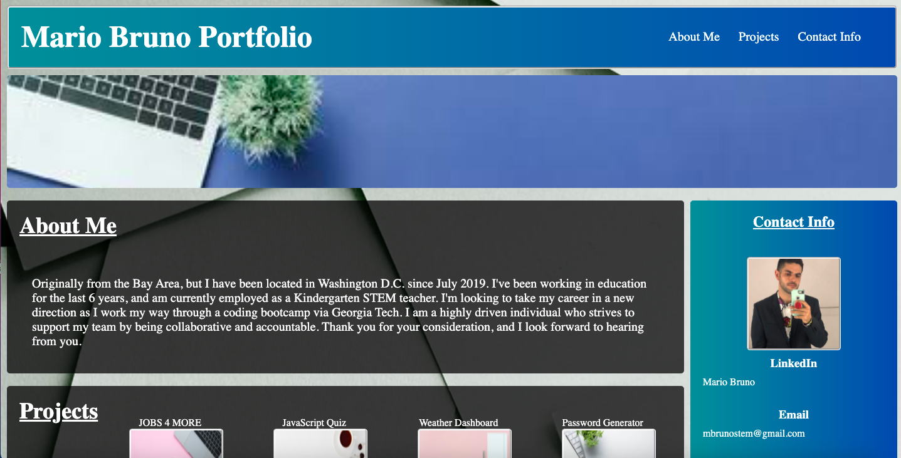

## User Story
As an employer I want to view an online portfolio of applicants.
WHEN I click hyperlinks
THEN I am taken to the corresponding web page
WHEN I click the navigation bar
THEN I am taken to the corresponding section of the web page
WHEN I view the developer tools
THEN I see semantic elements in the code

## Deployed Site
https://mbrunostem.github.io/updated-portfolio/

